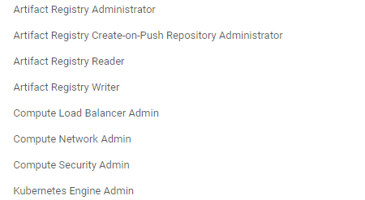

## DevOps Project in GCP

### Agenda

The agenda of this project is to divide the required tasks in 3 parts

1. Prepare the local development environment along with initiating few stock keeping units in GCP cloud and Github Repository

2. Deploy the instrasture with Github Action Workflows as an end to end CICD pipeline

3. Deploy the web application with Workflows as well and ensure the app is accisible from internet

#### Local Environment Setup Prerequisites:

- Install Git: [Git on ubuntu 24.04](https://thelinuxforum.com/articles/865-install-git-on-ubuntu-24-04#:~:text=Git%20is%20a%20widely%20used,That's%20it!)
- Install [Docker CLI Tools](https://docs.docker.com/engine/install/ubuntu/)
- Install [kubectl](https://kubernetes.io/docs/tasks/tools/install-kubectl-linux/#install-using-native-package-management)
- Install [GCloud CLI](https://cloud.google.com/sdk/docs/install#deb) & [GCloud Auth Plugin]() tools
- Install [Terraform CLI](https://developer.hashicorp.com/terraform/tutorials/aws-get-started/install-cli) tool

#### Preparing the GCP Cloud Environment:

- Create an account in GCP
- Identify the **project_id**, **Region** details etc.
- Create a *Service Account* and keep the JSON key string for further use
- Assign the following **IAM Roles** to the *Service Account* for performing the required tasks for this project. *Note in Production environment Roles are propagated to groupds rather than individuals to adhere to Authentication and Authorization policies*
  
- Add the following APIs for underlying infrastructure provisioning, networking & monitoring
  - Compute Engine API
  - Kubernetes Engine API
  - Cloud Resource Manager API
  - Cloud Logging API
- Provision a GCS storage bucket for storing the terraform.tfstate files as backend service which will main the consistency of the initialized terraform states. This will also add a layer of security for the underlying platform and infrastructure
- Create a Google Artifact Registory separately and access the registory only with service account tokens to ensure securtity

#### Setup Github:

- Create the required repo
- Add the required reporsitory secrets to ensure the workdflows are triggered and executed with no crucial cloud data leak

#### Implement the pipeline to deploy a GKE cluster: 

- Refer to the following Github Repo for terraform configs: https://github.com/Dwaipayan-kubeopsin/gcp-devops-project-01/tree/main/gke-iac-terraform

- Refer to the worflows under .github/workflows for triggering the install for the entire GCP Infrastructure automatically with push/pull requests

- Notable observation:
  - Some of the github actions steps can have deprected and unsupported versions. Refer to [Official GitHub Documentation](https://docs.github.com/en/actions/about-github-actions/understanding-github-actions) for more details

#### Deploy the Web App in the Kubernetes environment:

- Referred to the following project for deploying the NEXT.js (Frontend + Bacend) application: https://github.com/vercel/next.js/tree/canary/packages/create-next-app

- Using docker along with github workflow facilated that the entire deployment automatically from packaging -> buidling the image -> pushing to repo -> perform test cases -> deploy the app in GKE -> access it from internet

- Note for prod level environment we can enable the managedCertificate, HTTPS features for extra added secuirty if a domain name is available

#### Some observation & further improvements:

- Ingress controller configuration for GCP External Load Balancers still supports some deprectaed annotation for the ingress to get deployed successfully. Please refer to the following documenation for more details: 

  - https://cloud.google.com/kubernetes-engine/docs/concepts/ingress#controller_summary
  - https://cloud.google.com/kubernetes-engine/docs/how-to/load-balance-ingress
  - https://cloud.google.com/kubernetes-engine/docs/tutorials/http-balancer
  - https://cloud.google.com/blog/products/devops-sre/using-github-actions-with-google-cloud-deploy
  - https://cloud.google.com/kubernetes-engine/docs/how-to/load-balance-ingress

- Explored the logs for GCP Ingress Load Balancers in details and focused on the JSONPayload fields to get a good idea about the call flows between frontend & backend configs

- Will further work on to implement a prometheus based monitoring for the webApp 

- The current state of the Deployment is automated, scalable, highly available & ingress to implement service discovery. 
